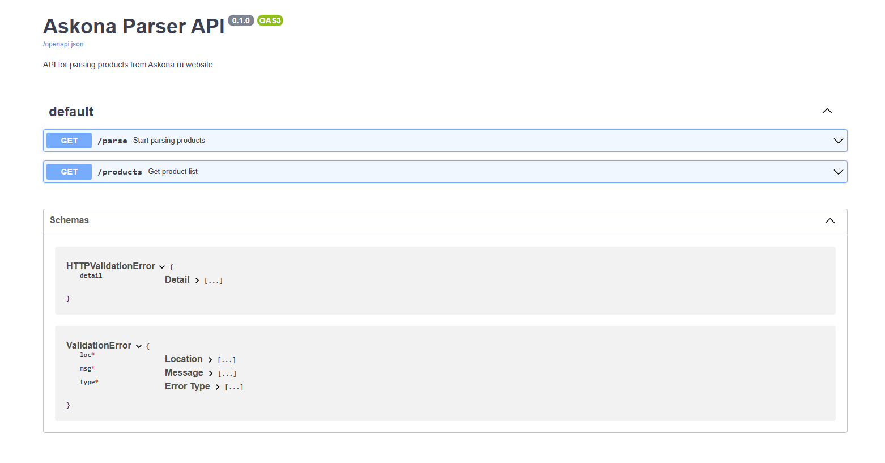
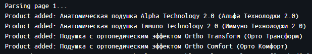
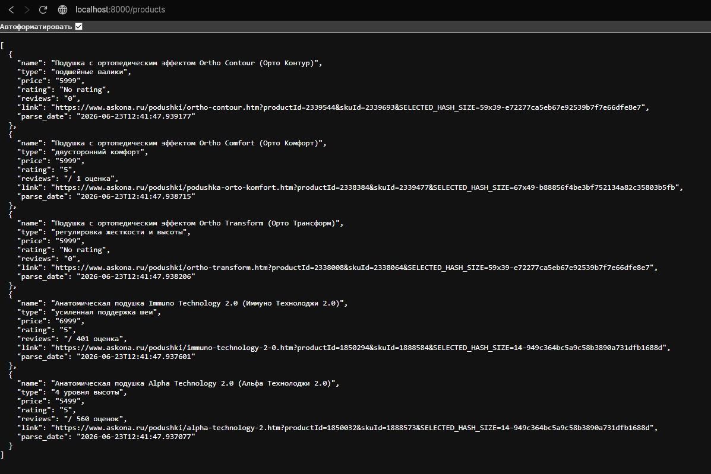

# Парсер товаров Askona

Проект представляет собой веб-сервис на FastAPI, который автоматически собирает информацию о товарах с сайта askona.ru (название, цена, рейтинг, отзывы, ссылка) с использованием Selenium WebDriver и сохраняет данные в PostgreSQL. Всё приложение упаковано в Docker Compose, что обеспечивает лёгкий запуск и изоляцию компонентов.

## Возможности

- Парсинг товаров из каталога Askona по заданному URL.
- Настройка количества извлекаемых товаров через параметр запроса.
- Сохранение данных в реляционную базу PostgreSQL с автоматическим обновлением существующих записей.
- Получение списка последних спарсенных товаров через REST API.
- Интерактивная документация API (Swagger UI) доступна по адресу /docs.
- Запуск в отдельных Docker-контейнерах:
  - app – FastAPI приложение,
  - db – PostgreSQL,
  - chrome – Selenium Standalone Chrome (браузер в headless‑режиме),
  - pgadmin – веб-интерфейс для управления базой данных.

## Описание модулей

### main.py
Главный файл приложения FastAPI. Содержит два эндпоинта:
- /parse – запускает парсинг по переданному URL и количеству товаров. Возвращает статус и число успешно обработанных товаров.
- /products – возвращает последние limit записей из базы данных в формате JSON.

Использует классы AskonaParser и Database для выполнения логики.

### parser.py
Реализует класс AskonaParser, который управляет браузером через Selenium Remote WebDriver.
- create_driver() – создаёт экземпляр драйвера, подключаясь к контейнеру chrome.
- parse_product() – извлекает данные из одной карточки товара (название, тип, цена, рейтинг, количество отзывов, ссылка). При отсутствии какого-либо поля ставит значение по умолчанию.
- next_page() – переходит на следующую страницу каталога, если она доступна.
- parse() – основной метод, который проходит по страницам, собирает товары до достижения заданного лимита и возвращает список словарей с данными.
- close() – завершает работу драйвера.

### database.py
Обеспечивает взаимодействие с PostgreSQL через SQLAlchemy.

- Класс Product – ORM‑модель таблицы parsed_products (поля: id, name, type, price, rating, reviews, link, parse_date).
- Класс Database – предоставляет методы:
  - save_products() – сохраняет или обновляет записи в базе (по полю link).
  - get_products() – возвращает последние limit записей, отсортированных по дате парсинга.

Подключение к БД настраивается через переменную окружения DATABASE_URL.

## Рузельтаты

